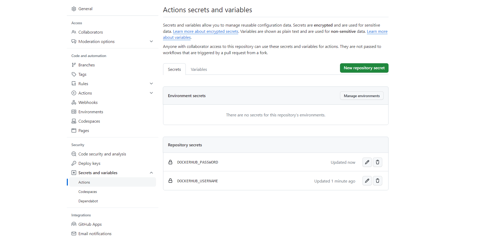

# Lab Report: Continuous Integration/Delivery with GitHub Actipns

## Assignment description

The goal of this lab was to have a first experience with CI/CD, using GitHub Actions:

- CI/CD is the automation of the manual human intervention needed to get new code into production. Thanks to this, changes are made incrementally and delivered more quickly into production. Also, CI/CD assures the new code to be reliable. Examples of human interventions that are automated by CI/CD are building, testing and linting.
- GitHub Actions is a tool in which CI/CD pipelines can be deployed through the use of workflows. Workflows contains jobs which are composed of steps. A workflow is triggered when an action, such as pushing, happens.

## Proof of work done

### 1. Creating a GitHub repository

As can be seen, I've first created the GitHub repository for the sample application:


### 2. Creating a new GitHub Actions workflow

After having pushed the `demo.yml` file into GitHub, I could indeed see a new workflow that appeared in the `Actions` tab of the repository:


### 3. Linting the code

The file `build.yml` was made with the following content:

```YAML
---
name: Build and test
on:
  push:
    branches:
      - main
jobs:
  build:
    runs-on: ubuntu-latest
    steps:
      - name: Check out repository code
        uses: actions/checkout@v3
      - name: Installing NodeJS
        uses: actions/setup-node@v3
        with:
          node-version: 18
      - name: Installing dependencies
        run: yarn install
      - name: Linting the project
        run: yarn lint
```

When pushing it into GitHub, the workflow failed as expected:


After fixing all the linting errors, the workflow passed succesfully:


### 4. Building the Docker image for the sample application

The file `build.yml` was modified as such:

```YAML
---
name: Build and test
on:
  push:
    branches:
      - main
jobs:
  build:
    runs-on: ubuntu-latest
    steps:
      - name: Check out repository code
        uses: actions/checkout@v3
      - name: Installing NodeJS
        uses: actions/setup-node@v3
        with:
          node-version: 18
      - name: Installing dependencies
        run: yarn install
      - name: Linting the project
        run: yarn lint
      - name: Building Docker image
        uses: docker/build-push-action@v4
        with:
          context: .
          tags: dani450/webapp
          push: false
```

When pushing it into GitHub, the workflow passed succesfully:


### 5. Pushing the Docker image to Docker Hub

The username and password for Docker Hub were added to the repository secrets



The `build.yml` file was then modified as such:

```YAML
---
name: Build and test
on:
  push:
    branches:
      - main
jobs:
  build:
    runs-on: ubuntu-latest
    steps:
      - name: Check out repository code
        uses: actions/checkout@v3
      - name: Installing NodeJS
        uses: actions/setup-node@v3
        with:
          node-version: 18
      - name: Installing dependencies
        run: yarn install
      - name: Linting the project
        run: yarn lint
      - name: Logging in to Docker Hub
        uses: docker/login-action@v3
        with:
          username: ${{ secrets.DOCKERHUB_USERNAME }}
          password: ${{ secrets.DOCKERHUB_PASSWORD }}
      - name: Building Docker image
        uses: docker/build-push-action@v4
        with:
          context: .
          tags: dani450/webapp
          push: true
```

When pushing the `build.yml` file into GitHub, the workflow passed succesfully


The pushed Docker image was also reflected on Docker Hub


### 6. Wrapping up

At last, you'll find here below an overview of workflow runs that can been seen in the GitHub Actions tab:


## Evaluation criteria

- [x] Show that you created a GitHub repository for the sample application
- [x] Show the overview of workflow runs in the GitHub Actions tab
- [x] Show that the application image is available on Docker Hub
- [x] Make a change to the sample application, commit and push, and show that the build pipeline is triggered automatically
- [x] Show that you wrote an elaborate lab report in Markdown and pushed it to the repository
- [ ] Show that you updated the cheat sheet with the commands you need to remember &rarr; There were no new commands learned from this lab.

## Issues

None

## Reflection

This lab was pretty easy; it was just a matter of following along and doing a few researches on the correct keywords that had to be used in the YAML file. Thanks to this lab, I now know how to set-up a basic CI/CD pipeline with GitHub Actions.

## Resources

- <https://github.com/marketplace/actions/setup-node-js-environment>
- <https://github.com/marketplace/actions/docker-build-push-action>
- <https://github.com/marketplace/actions/docker-login>
- <https://docs.github.com/en/actions/security-guides/using-secrets-in-github-actions>
- <https://docs.github.com/en/actions/learn-github-actions/understanding-github-actions>
