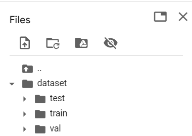
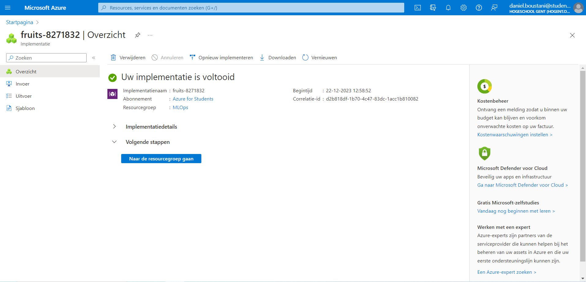
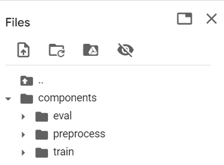
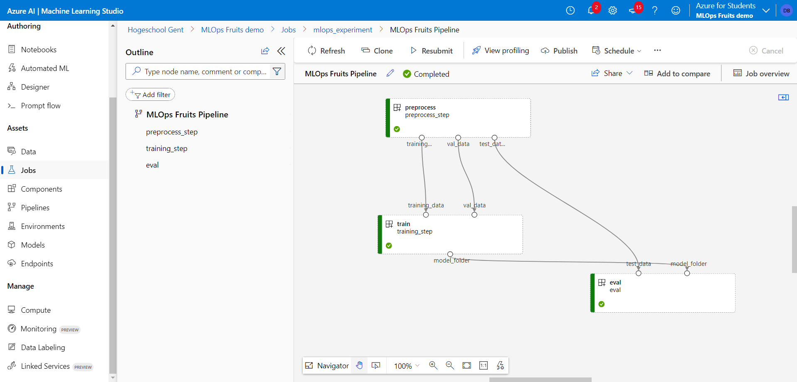
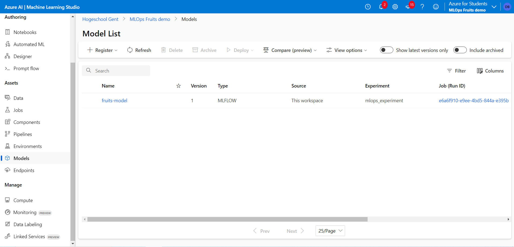
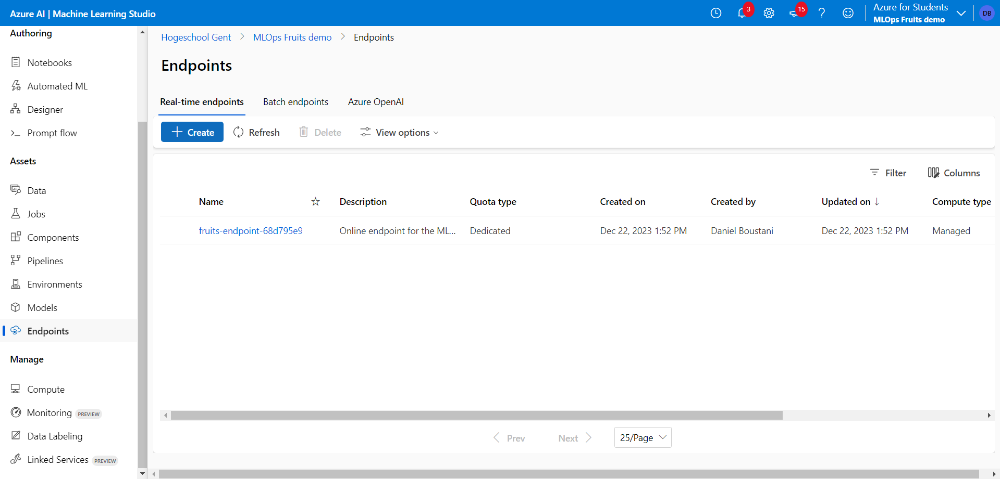
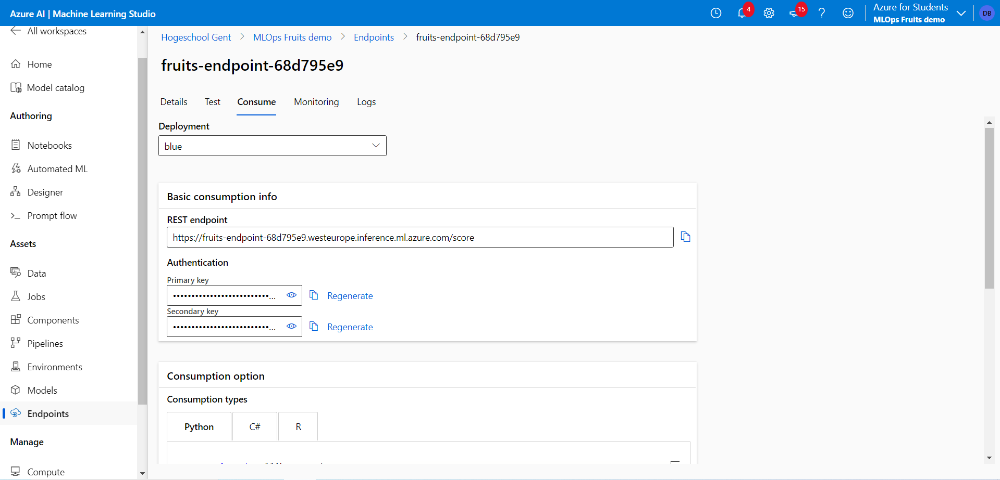

# Lab Report: The ML Workflow

## Assignment description

A ML model is just a small part of a ML-solution. There is a lot more around it like monitoring, CD/CI, testing, etc. ML-ops are the people responsbile of this. The goal of this lab was to see how ML-ops works, and more precisely how to set up a ML-workflow. The technologie used was Azure.

## Proof of work done

- After having installed the prerequesites, I execetued the code that creates the dataset. This created training, validation, and test sets:

  

- After that, I executed the code for preprocessing, building the model, training the model and evaluating the model. I thereafter executed the code to create a workspace. This was created succesfully

  

- The different components where build, and the pipeline was succesuflly created
  

  

- Registered model

  

- Endpoint

  

  

## Evaluation criteria

- [x] Show that you created an Azure ML workspace
- [x] Show that your ML workflow is working
- [x] Show that you deployed model to an Azure managed endpoint
- [x] Show that you are able to make a prediction with the deployed model
- [x] Show that you wrote an elaborate lab report in Markdown and pushed it to the repository
- [ ] Show that you updated the cheat sheet with the command you need to remember &rarr; No new command was learnt from this lab.

## Issues

None

## Reflection

/

## Resources

/
