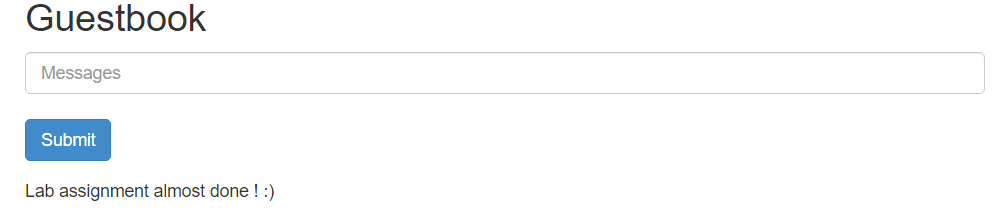

# Lab Report: Container orchestration with Kubernetes

## Assignment description

The goal of this assignment was to give us an introduction with an container orchestration system, namely Kubernetes. Kubernetes ables the deployment, scaling, and management of containerized applications to be automated.

By going over various examples, the assignment gave us an introduction to Deployments, Pods, labels, manifest files and jobs.

## Proof of work done

### 1. Set up the lab environment

Here below you'll find some pictures that show that the lab environment was setted up.


### 2. Basic operation

#### 2.1 Hello world !

1. First a deployment called hello-node was created. This deployment ran a agnhost image on its pod. The `http-port` option tells the agnhost container to listen on port `8080` for HTTP traffic.

   ```console
   $ kubectl create deployment hello-node --image=registry.k8s.io/e2e-test-images/agnhost:2.39 -- /agnhost netexec --http-port=8080
   deployment.apps/hello-node created
   ```

2. The deployment was created succesfully, since it could be visible in the list of deployments and on the dashboard.

   ```console
   kubectl get deployments
   NAME         READY   UP-TO-DATE   AVAILABLE   AGE
   hello-node   1/1     1            1           46s
   ```

   

   The Pod managed by the Deployment was also visible.

   ```console
   kubectl get pods
   NAME                         READY   STATUS    RESTARTS   AGE
   hello-node-ccf4b9788-hnhpx   1/1     Running   0          4m29s
   ```

   

3. Using the command `kubectl expose deployment hello-node --type=LoadBalancer --port=8080`, the Pod (actually the container inside the Pod) was exposed as a Kubernetes Service. Using the appropriate command, we could note that the Pod was succesfully exposed as a service.

4. ```console
   kubectl get services
   NAME         TYPE           CLUSTER-IP       EXTERNAL-IP   PORT(S)          AGE
   hello-node   LoadBalancer   10.111.222.144   <pending>     8080:32079/TCP   11s
   kubernetes   ClusterIP      10.96.0.1        <none>        443/TCP          17h
   ```

5. The Service was accessible through the browser using the `minikube service hello-node` command.

   ```console
   minikube service hello-node
   |-----------|------------|-------------|-----------------------------|
   | NAMESPACE |    NAME    | TARGET PORT |             URL             |
   |-----------|------------|-------------|-----------------------------|
   | default   | hello-node |        8080 | http://192.168.59.101:32079 |
   |-----------|------------|-------------|-----------------------------|
   * Opening service default/hello-node in default browser...
   ```

   

### 2.2 Working with manifest files

1. The application was first deployed using each file separately.

   ```console
   kubectl apply -f .\echo-deployment.yml
   deployment.apps/echo-deployment created

   kubectl apply -f .\echo-service.yml
   service/echo-service created
   ```

2. Using the command `minikube service echo-service`, I could access the application in the browser.

   ```console
   minikube service echo-service
   |-----------|--------------|-------------|-----------------------------|
   | NAMESPACE |     NAME     | TARGET PORT |             URL             |
   |-----------|--------------|-------------|-----------------------------|
   | default   | echo-service |        8080 | http://192.168.59.101:32474 |
   |-----------|--------------|-------------|-----------------------------|
   * Opening service default/echo-service in default browser...
   ```

   

3. Afterwards, the application was deployed using the `echo-all.yml` file.

   ```console
   kubectl apply -f echo-all.yml
   deployment.apps/echo-all-deployment created
   service/echo-all-service created
   ```

4. Inspecting the different components:

   ```console
   kubectl get service
   NAME               TYPE           CLUSTER-IP       EXTERNAL-IP   PORT(S)          AGE
   echo-all-service   LoadBalancer   10.108.155.220   <pending>     8080:30893/TCP   57s
   echo-service       NodePort       10.99.128.120    <none>        8080:31408/TCP   2m13s
   kubernetes         ClusterIP      10.96.0.1        <none>        443/TCP          18h
   ```

   ```console
   kubectl get pod
   NAME                                  READY   STATUS    RESTARTS   AGE
   echo-all-deployment-97d68d7cf-f5b6g   1/1     Running   0          64s
   echo-all-deployment-97d68d7cf-nkl4g   1/1     Running   0          64s
   echo-deployment-97d68d7cf-6z9w5       1/1     Running   0          2m29s
   ```

   ```console
   kubectl get deployment
   NAME                  READY   UP-TO-DATE   AVAILABLE   AGE
   echo-all-deployment   2/2     2            2           61s
   echo-deployment       1/1     1            1           2m25s
   ```

   ```console
   minikube service echo-all-service
   |-----------|------------------|-------------|-----------------------------|
   | NAMESPACE |       NAME       | TARGET PORT |             URL             |
   |-----------|------------------|-------------|-----------------------------|
   | default   | echo-all-service |        8080 | http://192.168.59.101:30893 |
   |-----------|------------------|-------------|-----------------------------|
   * Opening service default/echo-all-service in default browser...
   ```

   

5. The number of replicas was set to four. This was achieved succesfully as seen from the ouput of the commands below:

   ```console
   kubectl get deployment
   NAME                  READY   UP-TO-DATE   AVAILABLE   AGE
   echo-all-deployment   4/4     4            4           6h20m
   echo-deployment       1/1     1            1           6h22m
   ```

   ```console
   kubectl get pod
   NAME                                  READY   STATUS              RESTARTS       AGE
   echo-all-deployment-97d68d7cf-f5b6g   1/1     Running             1 (6h8m ago)   6h20m
   echo-all-deployment-97d68d7cf-fm2j6   1/1     Running             0              24s
   echo-all-deployment-97d68d7cf-nkl4g   1/1     Running             1 (6h8m ago)   6h20m
   echo-all-deployment-97d68d7cf-rq9m6   1/1     ContainerCreating   0              24s
   echo-deployment-97d68d7cf-6z9w5       1/1     Running             1 (6h8m ago)   6h21m
   ```

   We can see on which node each pod is running using the command `kubectl get pods -o wide`

   ```console
   kubectl get pods -o wide
   NAME                                  READY   STATUS    RESTARTS        AGE     IP            NODE       NOMINATED NODE   READINESS GATES
   echo-all-deployment-97d68d7cf-f5b6g   1/1     Running   1 (6h20m ago)   6h32m   10.244.0.23   minikube   <none>           <none>
   echo-all-deployment-97d68d7cf-fm2j6   1/1     Running   0               12m     10.244.0.30   minikube   <none>           <none>
   echo-all-deployment-97d68d7cf-nkl4g   1/1     Running   1 (6h20m ago)   6h32m   10.244.0.26   minikube   <none>           <none>
   echo-all-deployment-97d68d7cf-rq9m6   1/1     Running   0               12m     10.244.0.31   minikube   <none>           <none>
   echo-deployment-97d68d7cf-6z9w5       1/1     Running   1 (6h20m ago)   6h33m   10.244.0.29   minikube   <none>           <none>
   ```

   Finally, I send ten `GET` requests to the service, looking at the logs of the 4 pods (`kubectl logs -f <log>`). Only one pod (= echo-all-deployment-97d68d7cf-rq9m6) handled the requests

   ```bash
   for(($i = 0); $i -lt 10; $i++) {
     curl 192.168.59.101:30893
   }
   ```

   

   Increasing the number of requests to 1000, three of the pods handled the requests at some point

   

## 3. Labels and selectors

### 3.1. Manipulating labels manually

1. After having changed the number of replicas back to two, I verified what labels the pods already had before adding the new label

   ```console
   kubectl get pod --show-labels
   NAME                                  READY   STATUS    RESTARTS       AGE    LABELS
   echo-all-deployment-97d68d7cf-fm2j6   1/1     Running   0              2d2h   app=echoserver,pod-template-hash=97d68d7cf
   echo-all-deployment-97d68d7cf-nkl4g   1/1     Running   1 (2d8h ago)   2d8h   app=echoserver,pod-template-hash=97d68d7cf
   echo-deployment-97d68d7cf-6z9w5       1/1     Running   1 (2d8h ago)   2d9h   app=echoserver,pod-template-hash=97d68d7cf
   ```

   I then applied the labels and checked if it worked

   ```console
   kubectl label pod echo-all-deployment-97d68d7cf-nkl4g application_type=demo
   pod/echo-all-deployment-97d68d7cf-nkl4g labeled
   kubectl label pod echo-all-deployment-97d68d7cf-fm2j6 application_type=demo
   pod/echo-all-deployment-97d68d7cf-fm2j6 labeled
   ```

   ```console
   kubectl get pod --show-labels
   NAME                                  READY   STATUS    RESTARTS       AGE    LABELS
   echo-all-deployment-97d68d7cf-fm2j6   1/1     Running   0              2d2h   app=echoserver,application_type=demo,pod-template-hash=97d68d7cf
   echo-all-deployment-97d68d7cf-nkl4g   1/1     Running   1 (2d9h ago)   2d9h   app=echoserver,application_type=demo,pod-template-hash=97d68d7cf
   echo-deployment-97d68d7cf-6z9w5       1/1     Running   1 (2d9h ago)   2d9h   app=echoserver,pod-template-hash=97d68d7cf
   ```

2. Changing the label's value without the `overwrite` option does indeed generate an error.

   ```console
   kubectl label pod echo-all-deployment-97d68d7cf-fm2j6 application_type=production
   error: 'application_type' already has a value (demo), and --overwrite is false
   ```

   Now with the overwrite option:

   ```console
   kubectl label pod echo-all-deployment-97d68d7cf-fm2j6 --overwrite application_type=production
   pod/echo-all-deployment-97d68d7cf-fm2j6 labeled
   kubectl get pod --show-labels
   NAME                                  READY   STATUS    RESTARTS       AGE    LABELS
   echo-all-deployment-97d68d7cf-fm2j6   1/1     Running   0              2d3h   app=echoserver,application_type=production,pod-template-hash=97d68d7cf
   echo-all-deployment-97d68d7cf-nkl4g   1/1     Running   1 (2d9h ago)   2d9h   app=echoserver,application_type=demo,pod-template-hash=97d68d7cf
   echo-deployment-97d68d7cf-6z9w5       1/1     Running   1 (2d9h ago)   2d9h   app=echoserver,pod-template-hash=97d68d7cf
   ```

3. Deleting Pods with `application_type=demo` resulted in the following:

   ```console
   kubectl delete pods -l application_type=demo
   pod "echo-all-deployment-97d68d7cf-nkl4g" deleted
   kubectl get pod --show-labels
   NAME                                  READY   STATUS    RESTARTS       AGE     LABELS
   echo-all-deployment-97d68d7cf-624xf   1/1     Running   0              2m19s   app=echoserver,pod-template-hash=97d68d7cf
   echo-all-deployment-97d68d7cf-fm2j6   1/1     Running   0              2d3h    app=echoserver,application_type=production,pod-template-hash=97d68d7cf
   echo-deployment-97d68d7cf-6z9w5       1/1     Running   1 (2d9h ago)   2d9h    app=echoserver,pod-template-hash=97d68d7cf
   ```

   &rarr; The Pod that was immediately created to ensure the ReplicaSet has the _default_ labels: `app=echoserver,pod-template-hash=97d68d7cf`

4. Removing `application_type` label from remaining Pod

   ```console
   kubectl label pod echo-all-deployment-97d68d7cf-fm2j6 application_type-
   pod/echo-all-deployment-97d68d7cf-fm2j6 unlabeled
   ```

   Removing all Deployments (all Pods will also be deleted):

   ```console
   kubectl delete deployment --all
   deployment.apps "echo-all-deployment" deleted
   deployment.apps "echo-deployment" deleted
   ```

   Removing all Services:

   ```console
   kubectl delete service --all
   service "echo-all-service" deleted
   service "echo-service" deleted
   service "kubernetes" deleted
   ```

### 3.2. Setting labels in the manifest file

1. Applying manifest file:

   ```console
   kubectl apply -f .\example-pods.with-labels.yml
   pod/fe-dev created
   pod/fe-acceptance created
   pod/fe-prod created
   pod/api-dev created
   pod/api-acceptance created
   pod/api-prod created
   pod/db-dev created
   pod/db-acceptance created
   pod/db-prod created
   ```

2. - Select pods in the production environment:

     ```console
     kubectl get pod -l env=production
     NAME       READY   STATUS    RESTARTS   AGE
     api-prod   1/1     Running   0          2m33s
     db-prod    1/1     Running   0          2m32s
     fe-prod    1/1     Running   0          2m34s
     ```

   - Select pods not in the production environment:

     ```console
     kubectl get pod -l env!=production
     NAME             READY   STATUS    RESTARTS   AGE
     api-acceptance   1/1     Running   0          3m48s
     api-dev          1/1     Running   0          3m48s
     db-acceptance    1/1     Running   0          3m47s
     db-dev           1/1     Running   0          3m47s
     fe-acceptance    1/1     Running   0          3m48s
     fe-dev           1/1     Running   0          3m48s
     ```

   - Select pods in the development and acceptance environment (remark that logically, this is the same as the previous question, but you need to formulate your selector query differently)

     ```console
     kubectl get pod -l 'env in (development, acceptance)'
     NAME             READY   STATUS    RESTARTS   AGE
     api-acceptance   1/1     Running   0          12m
     api-dev          1/1     Running   0          12m
     db-acceptance    1/1     Running   0          12m
     db-dev           1/1     Running   0          12m
     fe-acceptance    1/1     Running   0          12m
     fe-dev           1/1     Running   0          12m
     ```

   - Select pods with release version 2.0

     ```console
     kubectl get pod -l release_version=2.0
     NAME             READY   STATUS    RESTARTS   AGE
     api-acceptance   1/1     Running   0          15m
     api-dev          1/1     Running   0          15m
     db-acceptance    1/1     Running   0          15m
     db-dev           1/1     Running   0          15m
     fe-acceptance    1/1     Running   0          15m
     fe-dev           1/1     Running   0          15m
     ```

   - Select pods owned by the API-team with release version 2.0

     ```console
     kubectl get pod -l team=api,release_version=2.0
     NAME             READY   STATUS    RESTARTS   AGE
     api-acceptance   1/1     Running   0          19m
     api-dev          1/1     Running   0          19m
     ```

   - Delete all pods in the development environment

     ```console
     kubectl delete pod -l env=development
     pod "api-dev" deleted
     pod "db-dev" deleted
     pod "fe-dev" deleted
     ```

   - What is the quickest way to launch the pods you just deleted?

     &rarr; You just apply the manifest file

     ```console
     kubectl apply -f .\example-pods.with-labels.yml
     pod/fe-dev created
     pod/fe-acceptance unchanged
     pod/fe-prod unchanged
     pod/api-dev created
     pod/api-acceptance unchanged
     pod/api-prod unchanged
     pod/db-dev created
     pod/db-acceptance unchanged
     pod/db-prod unchanged
     ```

## 4. Jobs

1. After having applied the manifest file, I checked for the presence of the jobs:

   ```console
   kubectl get jobs --show-labels
   NAME   COMPLETIONS   DURATION   AGE    LABELS
   pi     0/1           105s       105s   batch.kubernetes.io/controller-uid=41c956b1-16fa-45ab-ae32-c8fef9f6f95e,batch.kubernetes.io/job-name=pi,controller-uid=41c956b1-16fa-45ab-ae32-c8fef9f6f95e,job-name=pi
   ```

2. I retrieved the Pod created by the job as such:

   ```console
   kubectl get pod -l job-name=pi
   NAME       READY   STATUS      RESTARTS   AGE
   pi-ws29h   0/1     Completed   0          3m38s
   ```

3. When viewing the logs of the Pod, the number π was indeed to be seen

   ```console
   kubectl logs pi-ws29h
   3.1415926535897932384626433832795028841971693993751058209749445923078164062862089986280348253421170679821480865132823066470938446095505822317253594081284811174502841027019385211055596446229489549303819644288109756659334461284756482337867831652712019091456485669234603486104543266482133936072602491412737245870066063155881748815209209628292540917153643678925903600113305305488204665213841469519415116094330572703657595919530921861173819326117931051185480744623799627495673518857527248912279381830119491298336733624406566430860213949463952247371907021798609437027705392171762931767523846748184676694051320005681271452635608277857713427577896091736371787214684409012249534301465495853710507922796892589235420199561121290219608640344181598136297747713099605187072113499999983729780499510597317328160963185950244594553469083026425223082533446850352619311881710100031378387528865875332083814206171776691473035982534904287554687311595628638823537875937519577818577805321712268066130019278766111959092164201989380952572010654858632788659361533818279682303019520353018529689957736225994138912497217752834791315155748572424541506959508295331168617278558890750983817546374649393192550604009277016711390098488240128583616035637076601047101819429555961989467678374494482553797747268471040475346462080466842590694912933136770289891521047521620569660240580381501935112533824300355876402474964732639141992726042699227967823547816360093417216412199245863150302861829745557067498385054945885869269956909272107975093029553211653449872027559602364806654991198818347977535663698074265425278625518184175746728909777727938000816470600161452491921732172147723501414419735685481613611573525521334757418494684385233239073941433345477624168625189835694855620992192221842725502542568876717904946016534668049886272327917860857843838279679766814541009538837863609506800642251252051173929848960841284886269456042419652850222106611863067442786220391949450471237137869609563643719172874677646575739624138908658326459958133904780275901
   ```

4. Creation of the cronjob:

   ```console
   kubectl create -f .\cronjob.yml
   cronjob.batch/hello created
   ```

5. Getting status of the cronjob:

   ```console
   kubectl get cronjob hello
   NAME    SCHEDULE    SUSPEND   ACTIVE   LAST SCHEDULE   AGE
   hello   * * * * *   False     0        46s             4m41s
   ```

   &rarr; From the output, we can see that the cronjob has ran/scheduled a job 46 seconds ago

6. Retrieving the jobs:

   ```console
   kubectl get jobs
   NAME             COMPLETIONS   DURATION   AGE
   hello-28350211   1/1           9s         3m6s
   hello-28350212   1/1           7s         2m6s
   hello-28350213   1/1           9s         66s
   hello-28350214   0/1           6s         6s
   pi               1/1           2m44s      37m
   ```

   From the output, we see that a new job has been scheduled, namely `hello-28350214`. To be able to view its logs, I first retrieved its Pod

   ```console
   kubectl get pods --selector=job-name=hello-28350214
   NAME                   READY   STATUS      RESTARTS   AGE
   hello-28350214-trplh   0/1     Completed   0          16s
   ```

   Finally, I could check the logs

   ```console
   kubectl logs hello-28350214-trplh
   Sun Nov 26 15:34:03 UTC 2023
   Hello from the Kubernetes cluster
   ```

## 5. Deploy a multi-tier web application

1. First, I created every manifest needed from the tutorial.

   ```console
   ls -l
   total 15
   -rw-r--r-- 1 School 197121 651 Nov 26 21:18 frontend-deployment.yml
   -rw-r--r-- 1 School 197121 511 Nov 26 21:19 frontend-service.yml
   -rw-r--r-- 1 School 197121 649 Nov 26 21:17 redis-follower-deployment.yml
   -rw-r--r-- 1 School 197121 360 Nov 26 21:17 redis-follower-service.yml
   -rw-r--r-- 1 School 197121 622 Nov 26 21:15 redis-leader-deployment.yml
   -rw-r--r-- 1 School 197121 326 Nov 26 21:16 redis-leader-service.yml
   ```

2. I applied the Redis deployment from the `redis-leader-deployment.yml` file.

   ```console
   kubectl apply -f .\redis-leader-deployment.yml
   deployment.apps/redis-leader created
   ```

   ```console
   kubectl get pod
   NAME                            READY   STATUS    RESTARTS   AGE
   redis-leader-6cc46676d8-g9k5x   1/1     Running   0          2m8s
   ```

   ```console
   logs -f deployment/redis-leader
   1:C 26 Nov 2023 20:26:07.700 # oO0OoO0OoO0Oo Redis is starting oO0OoO0OoO0Oo
   1:C 26 Nov 2023 20:26:07.700 # Redis version=6.0.5, bits=64, commit=00000000, modified=0, pid=1, just started
   1:C 26 Nov 2023 20:26:07.700 # Warning: no config file specified, using the default config. In order to specify a config file use redis-server /path/to/redis.conf
   1:M 26 Nov 2023 20:26:07.705 * Running mode=standalone, port=6379.
   1:M 26 Nov 2023 20:26:07.706 # Server initialized
   1:M 26 Nov 2023 20:26:07.706 # WARNING you have Transparent Huge Pages (THP) support enabled in your kernel. This will create latency and memory usage issues with Redis. To fix this issue run the command 'echo never > /sys/kernel/mm/transparent_hugepage/enabled' as root, and add it to your /etc/rc.local in order to retain the setting after a reboot. Redis must be restarted after THP is disabled.
   1:M 26 Nov 2023 20:26:07.708 * Ready to accept connections
   ```

3. I applied the Redis Service from the `redis-leader-service.yml` file.

   ```console
   kubectl apply -f redis-leader-service.yml
   service/redis-leader created
   ```

   ```console
   kubectl get service
   NAME           TYPE        CLUSTER-IP       EXTERNAL-IP   PORT(S)    AGE
   kubernetes     ClusterIP   10.96.0.1        <none>        443/TCP    6h29m
   redis-leader   ClusterIP   10.106.176.227   <none>        6379/TCP   58s
   ```

4. I applied the Redis Deployment from the `redis-follower-deployment.yml` file.

   ```kubectl
   kubectl apply -f redis-follower-deployment.yml
   deployment.apps/redis-follower created
   ```

   ```kubectl
   kubectl get pod
   NAME                              READY   STATUS    RESTARTS   AGE
   redis-follower-5bdd6fffcb-5t8nw   1/1     Running   0          39s
   redis-follower-5bdd6fffcb-q9b9r   1/1     Running   0          39s
   redis-leader-6cc46676d8-g9k5x     1/1     Running   0          15m
   ```

5. I applied the Redis Service from the `redis-follower-service.yml` file

   ```console
   kubectl apply -f redis-follower-service.yml
   service/redis-follower created
   ```

   ```console
   kubectl get service
   NAME             TYPE        CLUSTER-IP       EXTERNAL-IP   PORT(S)    AGE
   kubernetes       ClusterIP   10.96.0.1        <none>        443/TCP    6h39m
   redis-follower   ClusterIP   10.96.190.200    <none>        6379/TCP   22s
   redis-leader     ClusterIP   10.106.176.227   <none>        6379/TCP   11m
   ```

6. I applied the frontend Deployment from the `frontend-deployment.yml` file

   ```console
   kubectl apply -f frontend-deployment.yml
   deployment.apps/frontend created
   ```

   When retrieving the frontend pods, we indeed see three replicas as expected from the manifest file

   ```console
   kubectl get pods -l app=guestbook -l tier=frontend
   NAME                       READY   STATUS    RESTARTS   AGE
   frontend-c6ff96854-b2v2v   1/1     Running   0          2m19s
   frontend-c6ff96854-jm2st   1/1     Running   0          2m19s
   frontend-c6ff96854-zrxpn   1/1     Running   0          2m19s
   ```

7. I applied the frontend Service from the `frontend-service.yml` file

   ```console
   kubectl apply -f frontend-service.yml
   service/frontend created
   ```

   When retrieving the services, we see that the frontend service is running:

   ```console
   kubectl get services
   NAME             TYPE        CLUSTER-IP       EXTERNAL-IP   PORT(S)    AGE
   frontend         ClusterIP   10.97.17.36      <none>        80/TCP     23s
   kubernetes       ClusterIP   10.96.0.1        <none>        443/TCP    6h47m
   redis-follower   ClusterIP   10.96.190.200    <none>        6379/TCP   8m14s
   redis-leader     ClusterIP   10.106.176.227   <none>        6379/TCP   18m
   ```

8. I forwarded port 8080 to port 80 of the service:

   ```console
   kubectl port-forward svc/frontend 8080:80
   Forwarding from 127.0.0.1:8080 -> 80
   Forwarding from [::1]:8080 -> 80
   ```

   The guestbook was then visible in the browser on `http://localhost:8080`

   

## Cheat sheet expansion

The cheat sheet was expanded with following commands

| Task                                                                                                             | Command                                                        |
| :--------------------------------------------------------------------------------------------------------------- | :------------------------------------------------------------- | ----------------- |
| Prints a table of the most important information about the specified resource                                    | `kubectl get <resource>`                                       |
| Creates a Kubernetes deployment, specifying the deployment name with <name> and the container image with <image> | `kubectl create deployment <name> --image=<image>`             |
| Creates a service of type <type> that exposes a deployment to the external world on port <port>                  | `kubectl expose deployment <name> --type=<type> --port=<port>` |
| Returns the URL for a service                                                                                    | `minikube service <service>`                                   |
| Pauses Kubernetes                                                                                                | `minikube pause`                                               |
| Unpause Kubernetes                                                                                               | `minikube unpause`                                             |
| Halt the cluser                                                                                                  | `minikube stop`                                                |
| Browse the catalog on installed Kubernetes services                                                              | `minikube addons list`                                         |
| View application logs for a container in a pod (if pod has one container)                                        | `kubectl logs <pod>`                                           |
| Delete service created in cluster                                                                                | `kubectl delete service <service>`                             |
| Delete deployment created in cluster                                                                             | `kubectl delete deployment <deployment>`                       |
| Enables/disables addon                                                                                           | `minikube addons <enable>`                                     | disable> <addon>` |
| Apply configuration found in file to pod                                                                         | `kubectl apply -f <file>`                                      |
| Add label to a resource                                                                                          | `kubectl label <resource type> <resource name> <key>=<value>`  |
| Removes label from a resource                                                                                    | `kubectl label <resource type> <resource name> <key>-`         |
| Forward one or more local ports to a pod.                                                                        | `kubectl port-forward <pod> <local-port>:<remote-port>`        |
| Scale up/down Pods                                                                                               | `kubectl scale deployment <pod> --replicas=<number>`           |
| Deletes the Minikube VM.                                                                                         | `minikube delete`                                              |

## Evaluation criteria

- [x] Demonstrate that your Kubernetes cluster is running and that you are able to manage it:
  - [x] Open the dashboard to show what's running on the cluster: nodes, pods, services, deployments, etc.
  - [x] Also show these from the command line (using kubectl)
- [x] Show that all applications from this assignment are running on the cluster, both in the web browser and the resources necessary for each application (Pods, Deployments, Services, etc.)
- [x] Show that you can scale up and down the number of replicas of an application
- [x] Show that you can add, remove or change labels and selectors
- [x] Show that you can manipulate Kubernetes resources using labels and selectors
- [x] Show that you wrote an elaborate lab report in Markdown and pushed it to the repository
- [x] Show that you updated the cheat sheet with the commands you need to remember

## Issues

None

## Reflection

This assignment was very clear and easy to understand. After having seen Docker, it was very interesting to explore an orchestration tool for containers.

## Resources

No other resources were used expect the links found in the assignment and the `-h` option of the different commands.
