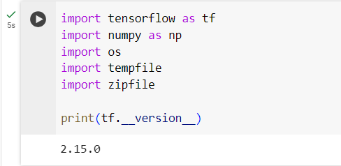

# Lab Report: Quantization and Pruning

## Assignment description

In many cases, ML-models run on regular computers, where memory seems infinite. Although there is nothing wrong with this in essence, there are many reasons as to why one would choose to not run ML-models on regular computers but on edge devices (Raspberry PI, smartphone, etc.). Such reasons are data privacy, less latency, closeness to data source, etc. The challenge with edge devices is how should one fit ML-models, which are complex and take a considerable amount of space, on edge devices where memory is sparse. Two techniques for this are **quantization** and **pruning**

The goal of this lab was to introduce us to the concepts of quantization and pruning, and their impact on a model size. For this purpose, we first made a baseline model. On this model, we applied the different techniques and we saw how each of them would reduce the size of the model. At the end, we applied both techniques and saw how the combination of both is a powerful tool to reduce a model's size.

- Explain quantization and pruning
- Explain the difference between post-training quantization and quantization aware training
- Explain the difference between weight pruning and quantization

> Both quantization and pruning try to achieve the same goal, namely reducing the model size, but in a different way. Quantization achieves this by reducing the precision with which the weights are represented. This means that the number of bits needed to represent the weights is reduced and thus less space is needed to store the model. On the other, pruning achieve this by zeroing out _insignificant weights_. This conceptually comes to cutting off the branches of the model that have a significant contribution. Physically, the zeroeid weights take no space and thus reduce the model size.

> Post training quantization is when quantization is applied to an already trained model. This leads to a loss of accuracy in the model's predictions. This can be countered by applying quantization aware training. Quantization aware training is when quantization is taken into account during the training phase. This happens by applying quantization during the training, and thus experiencing accuracy loss during training. This forces the readjusment of the weights to elevate the accuracy. Like this, the model becomes more resilient against the future quantization.

> The difference between quantization and weight pruning is that quantization reduces **all** the model's weights by reducing their precision. This means that insignificant weights will still be present after quantization. Weight pruning will remove insignificant weights, but will not modify the weights precision.

## Proof of work done

### 0. Preparation

Herebeneath you'll find material that shows that the environment was setted up correclty:

- Importing libraries and printing the version of TensorFlow

  

- Downloading and preparing the MNIST dataset

  

### 1. Baseline model

First, the initial Keras model was created. The model summary was the following:

```txt
Model: "sequential_1"
_________________________________________________________________
 Layer (type)                Output Shape              Param #
=================================================================
 reshape_1 (Reshape)         (None, 28, 28, 1)         0

 conv2d_1 (Conv2D)           (None, 26, 26, 12)        120

 max_pooling2d_1 (MaxPoolin  (None, 13, 13, 12)        0
 g2D)

 flatten_1 (Flatten)         (None, 2028)              0

 dense_1 (Dense)             (None, 10)                20290

=================================================================
Total params: 20410 (79.73 KB)
Trainable params: 20410 (79.73 KB)
Non-trainable params: 0 (0.00 Byte)
```

After compilation and training, the accuracy of the model against the test set and its size were printed. We could indeed see that the printed accuracy is around 91% for one epoch

```txt
test accuracy for baseline Keras model: 0.9455000162124634
model size in bytes for baseline h5: 98928
```

The `convert_tflite` function, which is used to convert the Keras model to a Tensorflow Lite format model, was completed as such:

```python
def convert_tflite(model, filename, quantize=False):
  '''
  Converts the model to TF Lite format and writes to a file

  Args:
    model (Keras model) - model to convert to TF Lite
    filename (string) - string to use when saving the file
    quantize (bool) - flag to indicate quantization

  Returns:
    None
  '''

  # Initialize the converter
  converter = tf.lite.TFLiteConverter.from_keras_model(model)

  # Set for quantization if flag is set to True
  if quantize:
    converter.optimizations = [tf.lite.Optimize.DEFAULT]

  # Convert the model
  tflite_model = converter.convert()

  # Save the model.
  with open(filename, 'wb') as f:
    f.write(tflite_model)
```

After having converted the model to the Tensorflow Lite format, there was indeed a difference in the model's size although no quantization had taken place yet:

```txt
model size in bytes for baseline h5: 98928
model size in bytes for non quantized tflite: 85096
```

And the accuracies were indeed approximatively the same:

```txt
test accuracy for baseline Keras model: 0.9455000162124634
test accuracy for non quantized tflite: 0.9455
```

### 2. Post-Training Quantization

When converting the model to a Tensorflow Lite model with quantization, there was indeed a huge decrease in its size:

```txt
model size for baseline h5: 98928
model size for non quantized tflite: 85096
model size for post training quantized tflite: 24336
```

The accuracy of the quantized TFLite model, in comparison with the others, was the following during my session:

```txt
test accuracy for baseline Keras model: 0.9455000162124634
test accuracy for non quantized tflite: 0.9455
test accuracy for post training quantized tflite: 0.9457
```

### 3. Quantization Aware Training

The baseline model was rebuild to a quantization aware model as such:

```python
import tensorflow_model_optimization as tfmot

# method to quantize a Keras model
quantize_model = tfmot.quantization.keras.quantize_model

# Define the model architecture.
model_to_quantize = model_builder()

# Reinitialize weights with saved file
model_to_quantize.load_weights(FILE_WEIGHTS)

# Quantize the model
q_aware_model = tfmot.quantization.keras.quantize_model(model_to_quantize)

# `quantize_model` requires a recompile.
q_aware_model.compile(optimizer='adam',
              loss='sparse_categorical_crossentropy',
              metrics=['accuracy'])
```

In the output of the model summary, we indeed remark some changes that allude that the model is quantization aware:

```txt
Model: "sequential_1"
_________________________________________________________________
 Layer (type)                Output Shape              Param #
=================================================================
 quantize_layer (QuantizeLa  (None, 28, 28)            3
 yer)

 quant_reshape_1 (QuantizeW  (None, 28, 28, 1)         1
 rapperV2)

 quant_conv2d_1 (QuantizeWr  (None, 26, 26, 12)        147
 apperV2)

 quant_max_pooling2d_1 (Qua  (None, 13, 13, 12)        1
 ntizeWrapperV2)

 quant_flatten_1 (QuantizeW  (None, 2028)              1
 rapperV2)

 quant_dense_1 (QuantizeWra  (None, 10)                20295
 pperV2)

=================================================================
Total params: 20448 (79.88 KB)
Trainable params: 20410 (79.73 KB)
Non-trainable params: 38 (152.00 Byte)
_________________________________________________________________
```

Here the comparisons of the accuracies for the different variants of the model:

```txt
test accuracy for baseline Keras model: 0.9455000162124634
test accuracy for non quantized tflite: 0.9455
test accuracy for post training quantized tflite: 0.9457
test accuracy for quantization aware non-quantized: 0.947700023651123
test accuracy for quantization aware quantized: 0.9476
```

### 4. Pruning

The to-be pruned model was build as such:

```python
# Get the pruning method
prune_low_magnitude = tfmot.sparsity.keras.prune_low_magnitude

# Compute end step to finish pruning after 2 epochs.
batch_size = 128
epochs = 2
validation_split = 0.1 # 10% of training set will be used for validation set.

num_images = train_images.shape[0] * (1 - validation_split)
end_step = np.ceil(num_images / batch_size).astype(np.int32) * epochs

# Define pruning schedule.
pruning_params = {
      'pruning_schedule': tfmot.sparsity.keras.PolynomialDecay(0.5, 0.8, 0, end_step),
}

# Pass in the trained baseline model
model_for_pruning = prune_low_magnitude(baseline_model, pruning_params)

# `prune_low_magnitude` requires a recompile.
model_for_pruning.compile(optimizer='adam',
              loss='sparse_categorical_crossentropy',
              metrics=['accuracy'])
```

The model summary was the following:

```txt
Model: "sequential_2"
_________________________________________________________________
 Layer (type)                Output Shape              Param #
=================================================================
 prune_low_magnitude_reshap  (None, 28, 28, 1)         1
 e_2 (PruneLowMagnitude)

 prune_low_magnitude_conv2d  (None, 26, 26, 12)        230
 _2 (PruneLowMagnitude)

 prune_low_magnitude_max_po  (None, 13, 13, 12)        1
 oling2d_2 (PruneLowMagnitu
 de)

 prune_low_magnitude_flatte  (None, 2028)              1
 n_2 (PruneLowMagnitude)

 prune_low_magnitude_dense_  (None, 10)                40572
 2 (PruneLowMagnitude)

=================================================================
Total params: 40805 (159.41 KB)
Trainable params: 20410 (79.73 KB)
Non-trainable params: 20395 (79.69 KB)
_________________________________________________________________
```

After having retrained the model, many of weights were indeed zeroed out:

```txt
<tf.Variable 'conv2d_2/kernel:0' shape=(3, 3, 1, 12) dtype=float32, numpy=
array([[[[-0.        ,  0.        , -0.        , -0.        ,
          -0.9055014 ,  0.        ,  0.        ,  0.8037277 ,
          -0.        , -0.        , -0.706316  ,  0.7153444 ]],

        [[-0.        ,  0.        , -0.        , -0.        ,
          -0.        ,  0.        ,  0.        ,  0.        ,
           0.        , -0.        , -1.025887  , -0.        ]],

        [[ 0.        ,  0.        , -0.        , -0.        ,
           0.8345351 ,  0.        ,  0.        ,  0.        ,
           0.        , -0.        , -1.0095204 , -1.0432383 ]]],


       [[[-0.        ,  0.        , -0.        , -0.        ,
          -1.1445985 ,  0.        , -0.        ,  0.        ,
          -0.        , -0.        ,  0.        ,  1.0123976 ]],

        [[ 0.8282131 ,  0.        , -0.        , -0.        ,
          -0.        ,  0.        , -0.        ,  0.        ,
           0.7866553 , -0.        ,  0.        , -0.        ]],

        [[-0.        ,  0.        ,  0.68092227, -0.        ,
           0.8050333 ,  0.        ,  0.        ,  0.8373778 ,
           0.        , -0.        ,  0.        , -0.92391366]]],


       [[[-0.        ,  0.        , -0.        , -0.        ,
          -0.95839316,  0.        , -0.        , -0.        ,
          -0.        , -0.        ,  0.89590615, -0.        ]],

        [[-0.        ,  0.        , -0.        ,  0.80026877,
          -0.        ,  0.        , -0.        ,  0.        ,
          -0.        , -0.        ,  0.96011513, -0.        ]],

        [[-0.        ,  0.        ,  0.7493355 , -0.        ,
           0.6981546 ,  0.        , -0.        ,  0.        ,
          -0.        , -0.        ,  0.        , -0.        ]]]],
      dtype=float32)>
```

When compressing the model using the `get_gzipped_mode_size`, it was very clear how pruning helps with reducing the size of the model. Combined with quantization, I was amazed at the size reduction:

```txt
gzipped model size in bytes for baseline h5: 98928
gzipped model size in bytes for non quantized tflite: 85096
gzipped model size in bytes for post training quantized tflite: 24336
gzipped model size in bytes for pruned non quantized h5: 98928
gzipped model size in bytes for baseline h5 (gzipped): 78073
gzipped model size in bytes for pruned non quantized h5 (gzipped): 25659
gzipped model size in bytes for pruned quantized tflite (gzipped): 8370
```

Accuracies:

```txt
accuracy for baseline Keras model: 0.9455000162124634
accuracy for non quantized tflite: 0.9455
accuracy for post training quantized tflite: 0.9457
accuracy for quantization aware non-quantized: 0.947700023651123
accuracy for quantization aware quantized: 0.9476
accuracy for pruned model h5: 0.9660000205039978
accuracy for pruned and quantized tflite: 0.9659
```

## Evaluation criteria

- [x] Show that you can convert a TensorFlow model to a TensorFlow Lite model with quantization
- [x] Show that you can train a quantize aware model
- [x] Show that you can perform weight pruning on a model
- [x] Show that your Jupyter notebook contains all cells' output
- [x] Show that you understand quantization and pruning (in your own words):
  - [x] Explain quantization and pruning
  - [x] Explain the difference between post-training quantization and quantization aware training
  - [x] Explain the difference between weight pruning and quantization
- [x] Show that you wrote an elaborate lab report in Markdown and pushed it to the repository
- [x] Show that you've executed the notebook and pushed it to the repository

## Issues

None

## Reflection

The lab was not difficult at all and was very well made. The lab was made in such a way that we would understand how both techniques help in achieving the goal of size reduction.

## Resources

I only used the resources found in this lab and the website herebelow:

- <https://deci.ai/quantization-and-quantization-aware-training/>
