# Lab Report: Monitoring and alerting

## Assignment description

When deploying a solution, the solution can become less efficient as time goes by, due to many factors. As ML-ops, its our duty to monitor this as to be able to adres the situation. However, it is not feasible for us to monitor each solution on a 24/24 basis. Like many things in IT, we would like to automate this process.

The goal of this Lab was to get our hands dirty with such monitoring system (Prometheus). We then setted up Grafana, which enhances our visual capacites of the metrics. Finally, we saw AlertManager through which we could generate notifications for certain situations.

## Proof of work done

### 1. Mocking the model

The `venv` virtual environment was created using the command `python -m venv venv`. The first `venv` argument is the python module that creates the virtual environment. The second argument is the name of the virtual environment, and could actually have any other name than _venv_.

Activating the environment on my computer was done by executing `source venv/Scripts/activate`, which is a bit different from what was shown in the assignment.

After installing the requirements and executing the mock, I could see the model at work on the console and at `http://localhost:5000/`. On the latter, the metric was to be seen right at the bottom. The exact name of this metric is gauge.

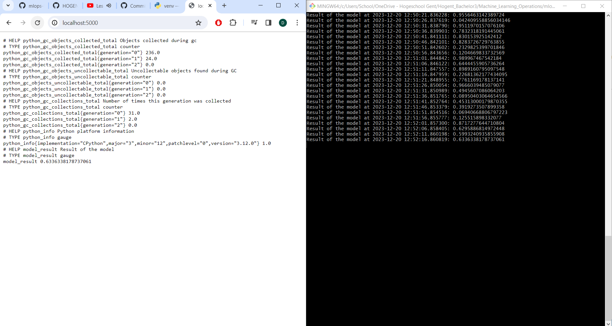

### 2. Setting up Prometheus

First I created a `prometheus.yml` config file as required in the lab. Afterwards, I created a `docker-compose.yml` file with the following content:

```YAML
services:
  prometheus:
    image: prom/prometheus
    volumes:
      - ./prometheus.yml:/etc/prometheus/prometheus.yml
    ports:
      - "9090:9090"
```

The container was setted up by executing `docker compose up -d`. When going to `http://localhost:9090`, there was indeed an error to be seen under `Status` > `Targets`:

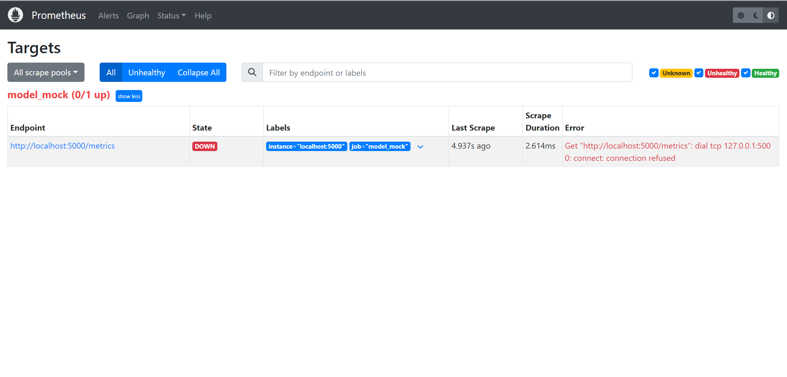

This was fixed by adding the `network-mode` in the `docker-compose.yml` file:

```YAML
services:
  prometheus:
    image: prom/prometheus
    volumes:
      - ./prometheus.yml:/etc/prometheus/prometheus.yml
    ports:
      - "9090:9090"
    network_mode: "host"
```

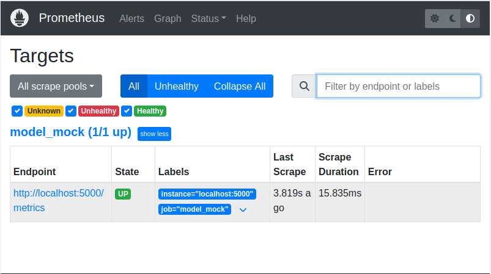

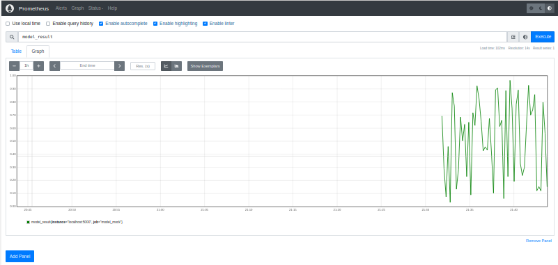

The metric is to be seen under `Graph` > `Table` and refreshed every 5 seconds.

### 3. Grafana

The `docker-compose.yml` file was modified as such for Grafana:

```YAML
services:
  prometheus:
    image: prom/prometheus
    volumes:
      - ./prometheus.yml:/etc/prometheus/prometheus.yml
    ports:
      - "9090:9090"
    network_mode: "host"

  grafana:
    image: grafana/grafana-oss
    ports:
      - "3000:3000"
```

After having executed the file (`docker compose up -d`) and heading to `http://localhost:3000`, the Grafana website was to be seen:

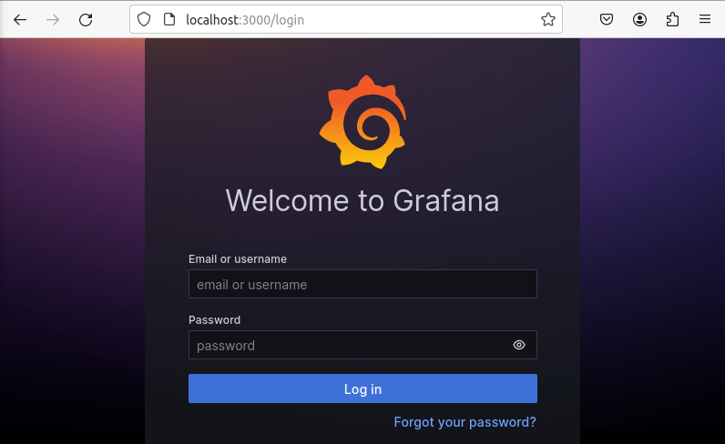

> The default creditentials are `admin` and `admin`.

Afterwards, the Prometheus polling server was added as a data source. When going to the `Home` > `Explore` section and quering the `model_result` metric, there was indeed a graph to be seen that only could be updated manually.

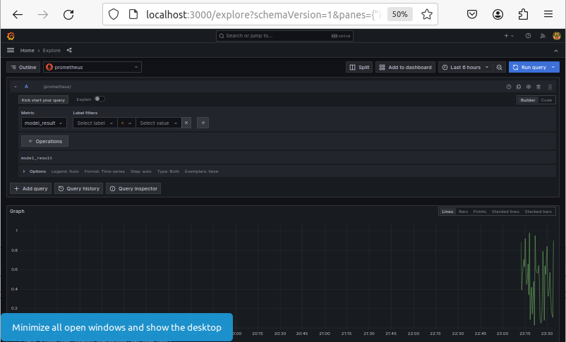

As to persistenly save the Grafana configuration, the `docker-compose.yml` file was modified as such:

```YAML
services:
  prometheus:
    image: prom/prometheus
    volumes:
      - ./prometheus.yml:/etc/prometheus/prometheus.yml
    ports:
      - "9090:9090"
    network_mode: "host"

  grafana:
    image: grafana/grafana-oss
    ports:
      - "3000:3000"
    volumes:
      - grafana-storage:/var/lib/grafana

volumes:
  grafana-storage: {}
```

Finally, the required dashboard was made. As can be seen from the image, the dashboard:

- refreshes every 5 seconds.
- shows the history of the past 15 minutes.
- has a threshold at $y = 0.75$
- shows the `model_result` metric

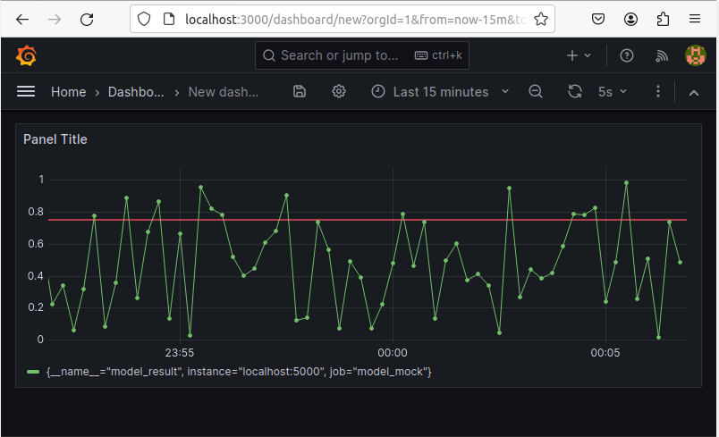

### 4. Alertmanager

#### 4.1. Generating alert

After having created the `rules.yml` file as required in the lab, the prometheus configuration file was changed. The `evaluation_interval` parameter and the `rule_files` configuration were added. The former states how often Prometheus should evaluate the rules, the latter states where the rules can be found:

> The `for` in the `rules.yml` files states for how long the alert should be active before sending a notifaction.

```YAML
global:
    scrape_interval: 5s
    evaluation_interval: 5s

rule_files:
    - rules.yml

scrape_configs:
    - job_name: model_mock
      static_configs:
          - targets:
                - localhost:5000
```

Then, the `docker-compose.yml` file was modified to copy the rules file to the volume:

```YAML
services:
  prometheus:
    image: prom/prometheus
    volumes:
      - ./prometheus.yml:/etc/prometheus/prometheus.yml
      - ./rules.yml:/etc/prometheus/rules.yml
    ports:
      - "9090:9090"
    network_mode: "host"

  grafana:
    image: grafana/grafana-oss
    ports:
      - "3000:3000"
    volumes:
      - grafana-storage/var/lib/grafana

volumes:
  grafana-storage: {}
```

After doing that, the following was to be seen under Alerts in the Prometheus polling service:

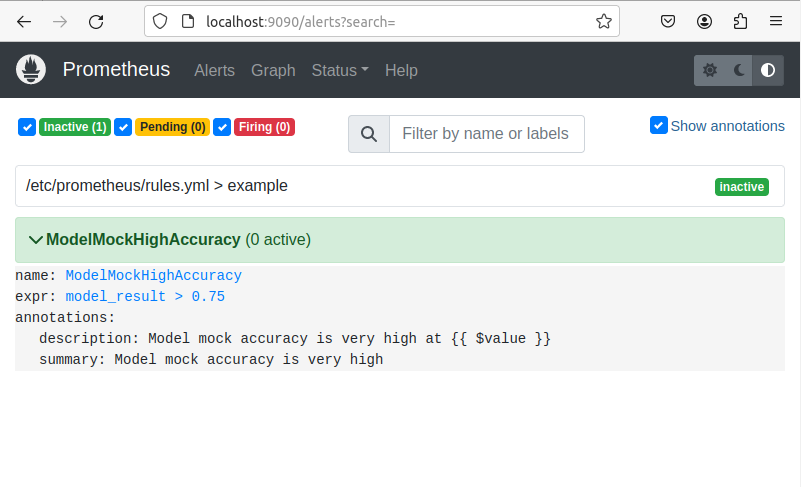

I monitored the metric for a bit on Grafana, and as soon as the metric exceeded 0.75, I went to checked if an alert was trigged. This was indeed the case:

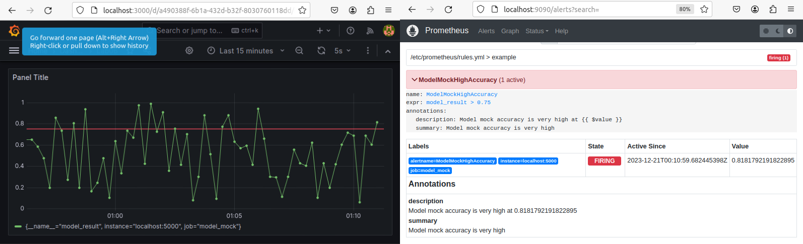

> Grouping groups alerts of similar types into a single notification. For example, if multiple services send an alert about not being able to reach a certain resource, a grouping will compact all those notifications into a single one.

> Inhibitions mutes certain alerts if another alert is triggerd. In other words, inhibitions are a way of conditionnaly mute alerts.

> Silences are a way of muting alerts for a given time. For this, matchers are used; if an alert matches with a matcher, the alert is silenced and thus no notification will be sent out.

To have better alert handling, `AlerManager` was setted up as required. For this, the `docker-compose.yml` file was extended with an `alertmanager` service:

```YAML
services:
  prometheus:
    image: prom/prometheus
    volumes:
      - ./prometheus.yml:/etc/prometheus/prometheus.yml
      - ./rules.yml:/etc/prometheus/rules.yml
    ports:
      - "9090:9090"
    network_mode: "host"

  grafana:
    image: grafana/grafana-oss
    ports:
      - "3000:3000"
    volumes:
      - grafana-storage/var/lib/grafana

  alertmanager:
    image: prom/alertmanager
    ports:
      - "9093:9093"

volumes:
  grafana-storage: {}
```

The Prometheus configuration file was also accordingly modified as asked in the lab. When going to `http://localhost:9093`, the following page was to be seen:

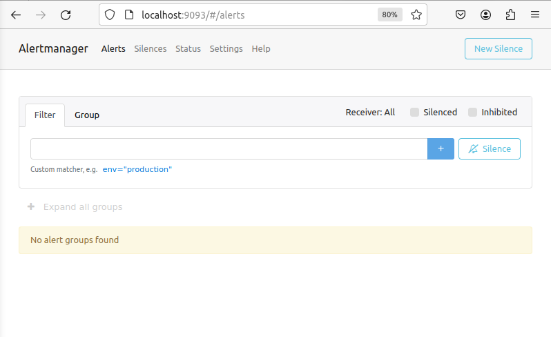

And when an alert had to be triggered, it was to be seen on the same webpage:

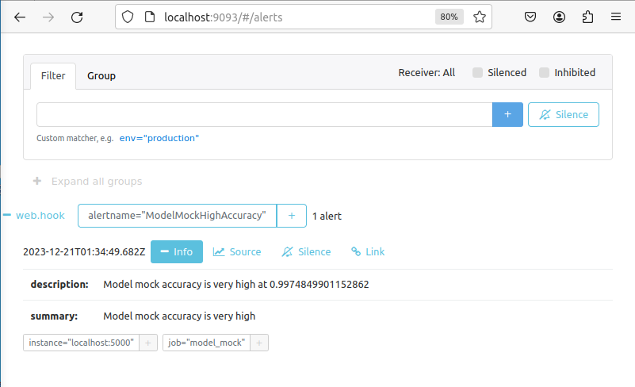

#### 4.5. Adding a receiver

First, I created a discord server consistng of two channels. The first channel is for the current model, and the second is for the VM (next exercise). I also created the webhook:

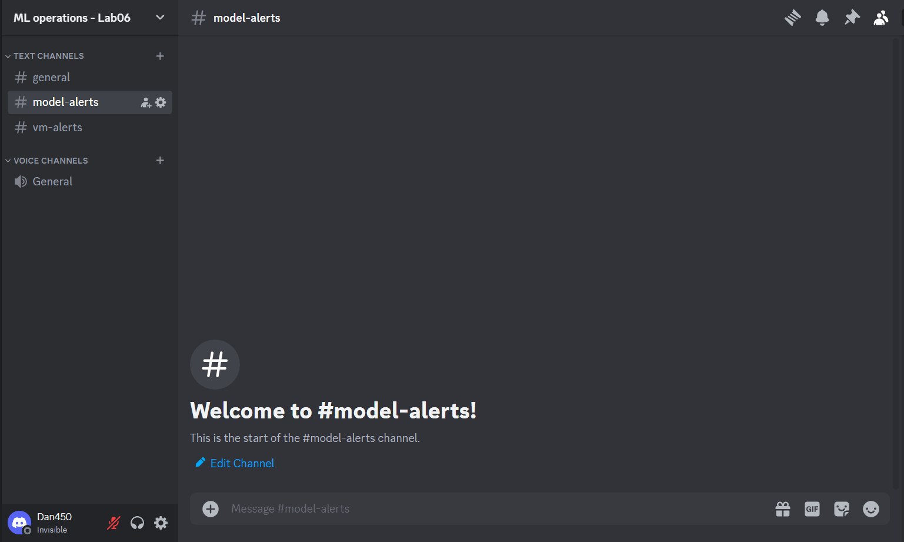

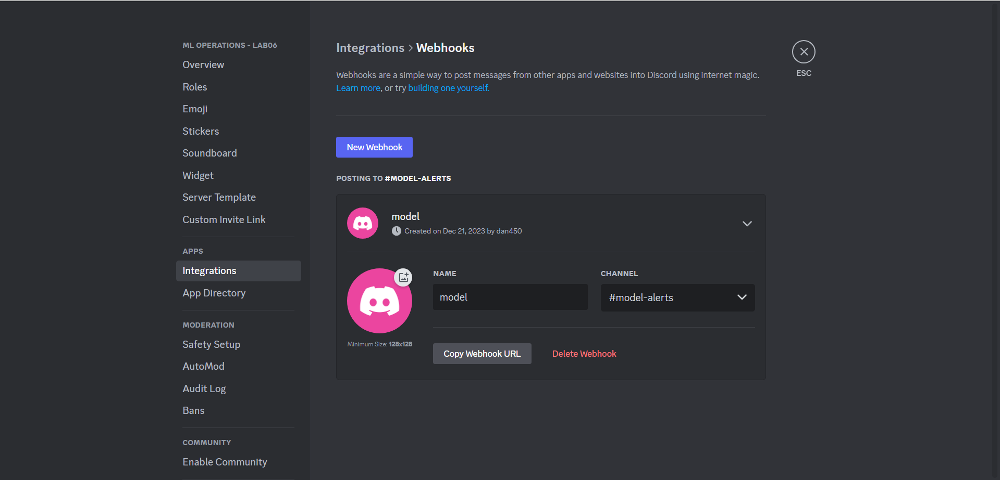

Afterwards, the configuration file for the AlertManager was created:

```YAML
route:
    group_by: ["..."]
    group_wait: 0s
    group_interval: 1s
    repeat_interval: 1h
    receiver: discord

receivers:
    - name: discord
      discord_configs:
          - webhook_url: https://discord.com/api/webhooks/1187442382057254912/582UFETo2BwZDCVoHnMFPXLFzoVKvvJeyKWQRrhoYCiNe5xIiRSii5j2O09-4S9vQ3GQ
            send_resolved: false
```

The `docker-compose.yml` was then modified so that the configuration file could be mapped to the right volume:

```YAML
services:
  prometheus:
    image: prom/prometheus
    volumes:
      - ./prometheus.yml:/etc/prometheus/prometheus.yml
      - ./rules.yml:/etc/prometheus/rules.yml
    ports:
      - "9090:9090"
    network_mode: "host"

  grafana:
    image: grafana/grafana-oss
    ports:
      - "3000:3000"
    volumes:
      - grafana-storage/var/lib/grafana

  alertmanager:
    image: prom/alertmanager
    volumes:
      - ./alertmanager.yml:/etc/alertmanager/alertmanager.yml
    ports:
      - "9093:9093"

volumes:
  grafana-storage: {}
```

When setting this all up, alerts were correctly being displayed on Discord inside the `model-alerts` channel

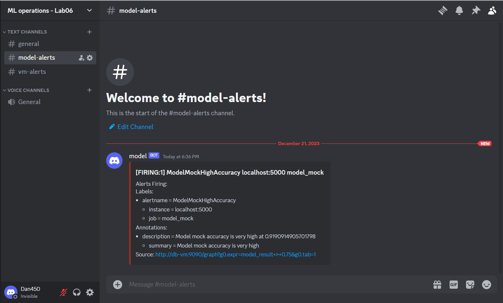

### 5. A more realistic use case

#### 5.1 Set up monitoring and visualization

I first installed AlmaLinux and setted up Node Exporter. To install Node Exporter, I've followed parts of this [tutorial](https://computingforgeeks.com/install-prometheus-node-exporter-rocky-almalinux/). Once this was done, Node Exporter was accessible inside and outisde the VM:

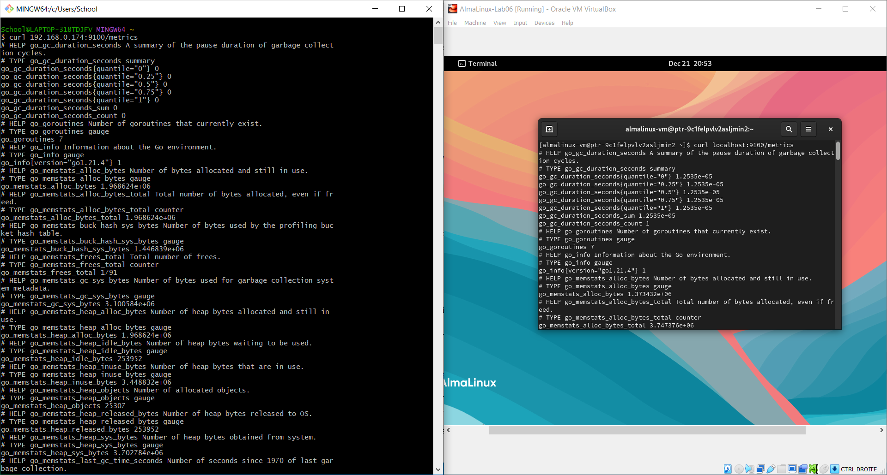

I also installed Grafana using this [tutorial](https://www.linuxcloudvps.com/blog/how-to-install-grafana-on-almalinux-9/)

The Prometheus configuration file was modified such that Prometheus knew from where to get the metrics from:

```YAML
  - job_name: "node_exporter_metrics"
    scrape_interval: 5s
    static_configs:
      - targets: ["localhost:9100"]
```

The Node Exporter Full dashboard was imported on Grafana. The Prometheus configuration file was modified as shown in the Node Exporter Full dashboard documentation. After doing this, the visualizations for the VM were to be seen:

```YAML
  - job_name: "node"
    static_configs:
      - targets: ["localhost:9100"]
```

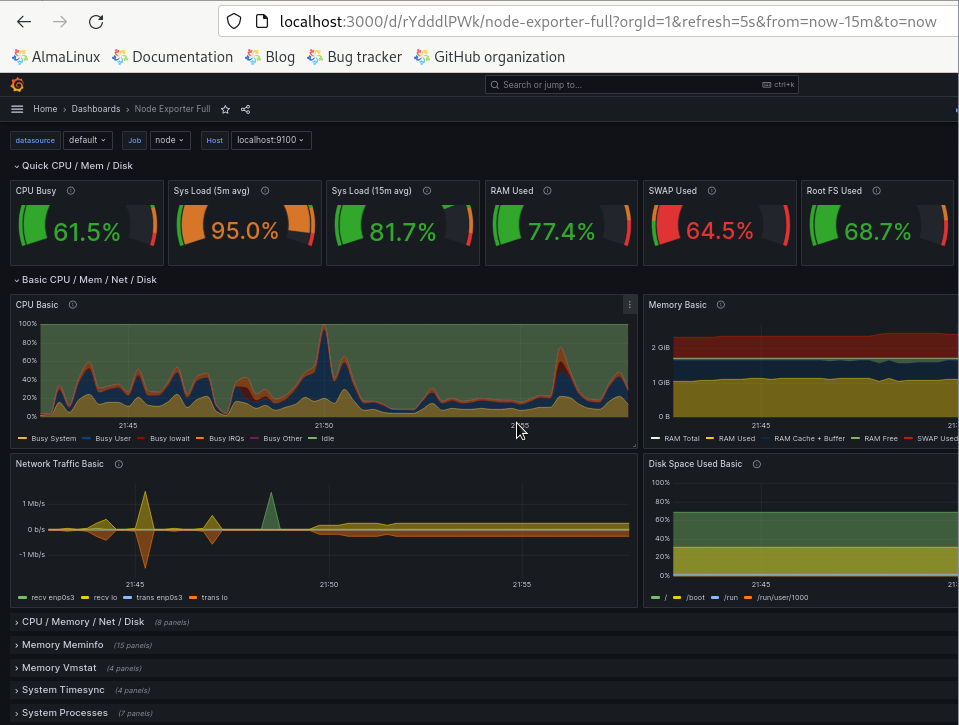

#### 5.2. Setting up alerting

First, AlertManager was installed using this [tutorial](https://computingforgeeks.com/configure-prometheus-email-alert-notification-using-alertmanager/). The Prometheus configuration file was modified to send the alerts to the AlertManager:

```YAML
alerting:
  alertmanagers:
    - static_configs:
        - targets:
           - localhost:9093
```

Thereafter, the `rules.yml` file was created with the following content:

```YAML
groups:
  - name: cpu_alert
    rules:
    - alert: HostHighCPULoad
      expr: (100 - (avg by (instance) (rate(node_cpu_seconds_total{mode="idle"}[1m])) * 100)) > 90
      for: 3m
      labels:
        severity: warning
      annotations:
        summary: "Host high CPU load (instance localhost:9100)
```

Let's decorticate the expression to understand what it means:

- `rate(node_cpu_seconds_total{mode="idle"}[1m]`: We calculate the per-second rate of increase in the time spend by the CPU being idle, over a 1-minute interval.
- `(avg by (instance) ...) * 100`: We take the average of the per-second rate of increase of every CPU. This will gives us a way to express the total time spent being idle. We express this as a percentage.
- `100 - ...`: By substracting the percentage that the CPU spent being idle from 100, we'll get the percentage of time the CPU spent being busy.

I then modified the Prometheus configuration file to take into account the rules file:

```YAML
rule_files:
   - rules.yml
```

Afterwards, `alertmanager.yml` was modified to send the alerts to discord.

```YAML
route:
    group_by: ["..."]
    group_wait: 0s
    group_interval: 1s
    repeat_interval: 1h
    receiver: "discord"

receivers:
    - name: discord
      discord_configs:
          - webhook_url: https://discord.com/api/webhooks/1187525905397076029/0-Krv094_AM5Yn9X9v39AYR3hIvecOj4X9zcDEqeGGcxF1nUm4bVdTntR1mO0bCol8l-
            send_resolved: true
```

Once this was all setted up, I tested the whole using the command `stress-ng --cpu 2 --timeout 3m` (I changed the `for` in the rules to 1m for the test). I indeed received the notifications on discord

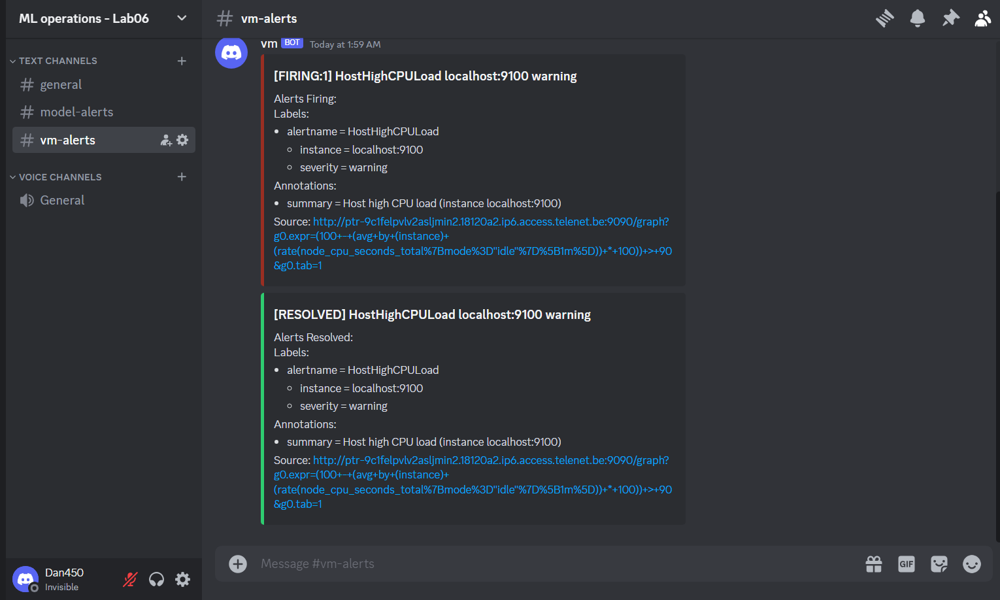

## Evaluation criteria

- [x] Show that your mocked model is running in a Python virtual environment and that you can access it's metrics by HTTP
- [x] Show that Prometheus receives the mocked model's metric
- [x] Show that Grafana receives the mocked model's metric
  - [x] The dashboard should refresh every 5 s
  - [x] The dashboard shows the history of the past 15 min
  - [x] The graph shows a red threshold line at $y = 0.75$
- [x] Show that you receive alerts about the mocked model metric through Discord
- [x] Show that Node Exporter is running on the VM and that you can access its metric's by HTTP
- [x] Show that you can see the CPU going to 100% by using `stress-ng`
- [x] Show that you don't receive an alert if the CPU is high for 2 min, but do receive an alert if the CPU is high for 4 min
  - [x] Also show that you can check these CPU values in Grafana
  - [x] Also show that you receive a resolve alert when the CPU load drops after the 4 min of high load
- [x] Show that you wrote an elaborate lab report in Markdown and pushed it to the repository
  - [x] Also show that the report contains all answers to the questions in the lab
- [ ] Show that you updated the cheat sheet with the commands you need to remember &rarr; There were no new commands learn from this lab.

## Issues

- Initially, I started this lab on my Windows machine. That's the reason why, in order to activate the virtual environment, I had to do `source venv/Scripts/activate` instead of `source/bin/activate`. Everything went well until I had to add the `host` `network_mode` in the `docker-compose.yml` file. This mode is currently not supported on Windows. To resolve this, I had to install a Linux machine. I installed Linux Mint on Virtualbox and went further with the lab.
- When adding Promotheus as a datasource in Grafana, I had to enter the Promotheus server URL. At first I tried `http://localhost:9090` but this didn't work. At first, I didn't understand why until I remembered that we're working in Docker. Since Promotheus was inside a container, I had to give the IP adres of the container and not that of localhost. I found the IP by using the command `ifconfig` (I could also have used `ip a`). The problem was then solved.
- After having setted up Node Exporter, I couldn't access it from outside the VM (as expected from what was written in the lab assignment). To solve this, I had to change the networking mode of the VM to _Bridged Networking_. Finally, I retrieved the IP of the VM using `ifconfig` and was able to access it from outside the VM.

## Reflection

I found this lab to be a nice last lab. It encapsulated approximatively everything that we learned in this course: containerization, virtualization and monitoring. The lab was not particularly hard but it was very long to set up.

## Resources

- <https://stackoverflow.com/questions/48915458/windows-run-docker-with-network-host-and-access-with-127-0-0-1>
- <https://prometheus.io/docs/alerting/latest/alertmanager/>
- <https://prometheus.io/docs/prometheus/latest/configuration/configuration/>
- <https://www.virtualbox.org/manual/ch06.html>
- <https://computingforgeeks.com/install-prometheus-node-exporter-rocky-almalinux/>
- <https://superuser.com/questions/1119701/how-to-access-server-running-in-virtualbox-from-the-host>
- <https://www.linuxcloudvps.com/blog/how-to-install-grafana-on-almalinux-9/>
- <https://computingforgeeks.com/configure-prometheus-email-alert-notification-using-alertmanager/>
